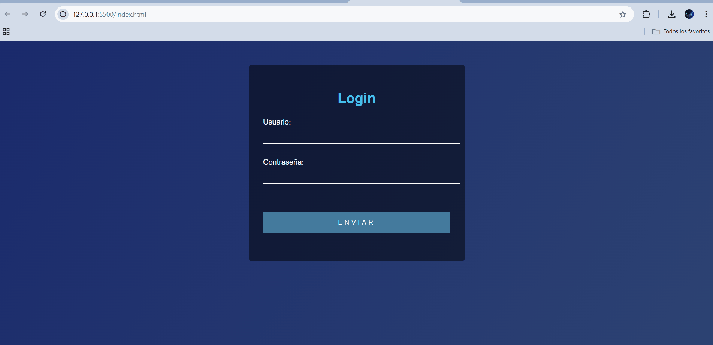

# Formulario de Login

Un formulario de inicio de sesión limpio y minimalista construido con HTML y CSS.

## Descripción

Este proyecto implementa un formulario de login básico con un diseño moderno y profesional, que incluye:
- Fondo con degradado
- Contenedor transparente con efecto blur
- Animaciones en campos de entrada
- Diseño responsive
- Efectos hover en botones

## Vista Previa


##  Estructura del Proyecto

```
login-form/
├── css/
│   └── styles.css
├── imagenes/
│   └── preview.png
├── index.html
└── README.md
```

## Tecnologías Utilizadas

- HTML5
- CSS3
  - Flexbox
  - CSS Grid
  - Transiciones
  - Degradados

## Instalación

1. Clona este repositorio
2. Abre `index.html` en tu navegador

## Características

- Fondo moderno con degradado
- Contenedor de formulario transparente
- Transiciones suaves al hacer hover
- Diseño responsive
- Validación de inputs
